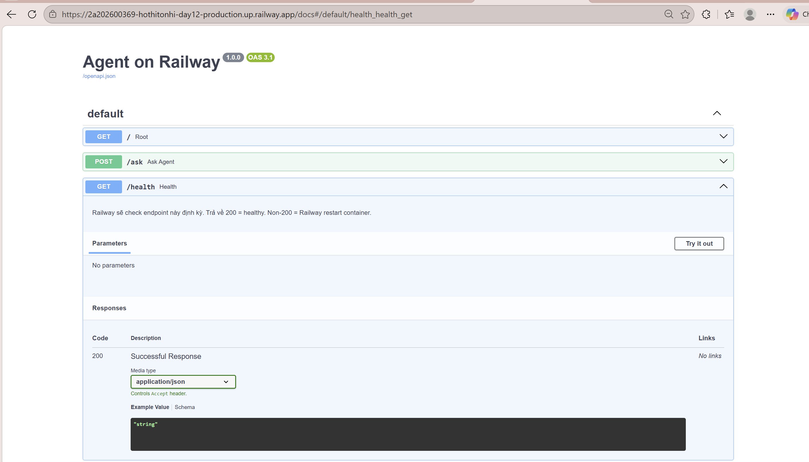

# Day 12 Lab - Mission Answers

## Part 1: Localhost vs Production

### Exercise 1.1: Anti-patterns found
1. **Hardcode Secrets (API Key & Database URL)**: Cố định thông tin nhạy cảm vào trong code (dòng 17-18). Việc này dẫn đến nguy cơ lộ lọt key và mật khẩu rất cao nếu đẩy mã nguồn lên GitHub. Cần chuyển sang dùng `.env` hoặc các biến môi trường.
2. **Không có Config Management / Hardcode cấu hình**: Cố định các biến môi trường cấu hình như `DEBUG = True` và `MAX_TOKENS = 500` (dòng 21-22). Làm hạn chế khả năng tùy biến và gây cản trở cho các môi trường triển khai khác nhau (Dev/Staging/Prod). Nên lưu các thông số này bằng các thư viện quản lý môi trường hoặc `os.getenv()`.
3. **Sử dụng `print` thay vì proper logging**: Việc dùng lệnh `print` để xem log (và tệ hơn là cố tình log ra Secret Key) ở dòng 32 là thiếu chuyên nghiệp (không có mức độ Error/Warning/Info, không có Timestamp). Cần sử dụng thư viện `logging` của Python thay vì print.
4. **Không có Health Check endpoint**: Endpoint như `/health` là tối quan trọng cho một Production app vì các dịch vụ monitor hoặc orchestrator (chẳng hạn Docker, Kubernetes) sẽ dùng endpoint này để kiểm tra xem hệ thống có đang sống không. Server hiện tại đang không có health check route nào.
5. **Cố định host và port khi chạy uvicorn**: `host="localhost"` và `port=8000` bị hardcode (dòng 51-52). Ở local thì có thể chạy được, nhưng khi triển khai lên các nền tảng Cloud thì ứng dụng cần host="0.0.0.0" và sử dụng các biến Port động do Provider cấp (qua `$PORT`).
6. **(Bonus) Bật tính năng `reload=True` không cần thiết**: Dùng reload ở production (dòng 53) làm cho memory và CPU chạy không tối ưu cũng như tăng rủi ro khi restart lại app thay vì một web server hoàn chỉnh (nếu deploy thực sự có thể phải dùng worker config).

### Exercise 1.3: Comparison table
| Feature | Basic (develop) | Advanced (production) | Tại sao quan trọng? |
|---------|-------|----------|---------------------|
| Môi trường / Host/ Port | `localhost:8000` (cố định) | `0.0.0.0` và load từ `PORT` (động) | Cần để Server có thể kết nối từ bên ngoài khi deploy lên Cloud/Docker thay vì chỉ chạy nội bộ trong máy tính Dev. |
| Config | Hardcode bí mật và cấu hình vào file app.py | Load từ Environment Variables (`.env`) qua pydantic_settings | Đảm bảo an toàn bảo mật, và linh hoạt thay đổi cấu hình qua lại giữa các máy chủ (Local/Dev/Prod) mà không cần sửa code. |
| Health check | Không có | Có các endpoints `/health`, `/ready` và `/metrics` | Giúp Load Balancer và các Cloud Orchestration tools (Docker, Kubernetes) theo dõi "sức khỏe" Server để restart nếu bị crash hoặc ngắt route API khi server quá tải. |
| Logging | `print()` thông báo lỗi | Structured JSON Logging (ghi log theo chuẩn cấu trúc) bằng Loguru/Logging | Phục vụ cho hệ thống Log Aggregator (Datadog, Kibana) dễ dàng parse log/monitor sau này, và đặc biệt KHÔNG in các Sensitive Data (như secret keys). |
| Shutdown | Ngắt đột ngột | Graceful Shutdown (cơ chế handle Lifespan và SIGTERM) | Đảm bảo server có khoảng nghỉ để hoàn thiện nốt in-flight request, đóng Database thay vì lập tức "giết" user đang gọi API giữa chừng. |

## Part 2: Docker

### Exercise 2.1: Dockerfile questions
1. **Base image:** `python:3.11` (Bản phân phối Python đầy đủ, kích thước khoảng ~1 GB).
2. **Working directory:** `/app` (Thư mục được khai báo bằng lệnh `WORKDIR /app` để làm thư mục mặc định cho các lệnh COPY và RUN phía sau).
3. **Tại sao COPY requirements.txt trước?**: Để tận dụng cơ chế **Layer Cache** của Docker. Code (`app.py`) thường xuyên bị thay đổi còn dependencies (`requirements.txt`) thì thỉnh thoảng mới tải mới. Bằng cách cài thư viện trước khi copy mã nguồn, mỗi khi sửa code, Docker chỉ cần build lại phần copy code (tốn 1 giây) thay vì phải liên tục reinstall lại toàn bộ thư viện tốn kém thời gian.
4. **Sự khác biệt giữa CMD vs ENTRYPOINT:** 
   - `CMD` thiết lập lệnh/tham số mặc định để chạy khi khởi động container và **cực kỳ dễ dàng bị ghi đè (override)** ngay lập tức từ bên ngoài (VD: chạy `docker run my-image /bin/bash` sẽ thay thế luôn lệnh CMD cũ).
   - `ENTRYPOINT` cài đặt file thực thi cốt lõi mang tính bắt buộc (không dễ ghi đè). Các tham số đặt phía sau lệnh `docker run` sẽ được nối tiếp vào sau ENTRYPOINT chứ không phá bỏ nó đi. Thường kết hợp cả 2: `ENTRYPOINT` định nghĩa app chính, `CMD` định nghĩa tham số mặc định.

### Exercise 2.3: Multi-stage build questions & Image size comparison

**1. Đọc Dockerfile và tìm:**
- **Stage 1 (Builder) làm gì?** Stage này dùng base image chuẩn, sau đó cài đặt các build tools (như `gcc`, `libpq-dev`, pip) để tải và build/compile toàn bộ các thư viện Python (numpy, pydantic...) từ source. Sau khi cài xong, các thư viện được lưu vào thư mục `/root/.local`. (Thư mục này và môi trường stage 1 sẽ không được đem đi deploy).
- **Stage 2 (Runtime) làm gì?** Stage này đóng vai trò là "môi trường sạch" chạy thực tế (Production). Nó sử dụng bản `python:3.11-slim` (rất nhẹ). Thay vì phải cài lại từ đầu, nó **COPY thẳng** cục thư viện đã cài sẵn (thư mục `.local`) từ Stage 1 sang đây, sau đó chép source code vào. Cuối cùng, gán quyền cho non-root user (appuser) để bảo mật.
- **Tại sao image ở multi-stage lại nhỏ hơn cực nhiều?** Vì Image cuối cùng (Runtime) đã vứt bỏ lại hoàn toàn các file rác, cache từ lúc tải package (`--no-cache-dir`) và các complier tools (gcc, c++...) đính kèm của hệ điều hành. Nói cách khác, nó chỉ giữ lại ĐÚNG những file code thư viện có thể chạy được, còn đồ nghề dùng để "xây" lên thư viện thì bị bỏ hết.

**2. Image size so sánh:**
- Develop: 1660 MB 
- Production: 236 MB 
- Difference: Nhẹ hơn khoảng ~85% so với bản Develop.

## Part 3: Cloud Deployment

### Exercise 3.1: Railway deployment
- URL: https://2a202600369-hothitonhi-production.up.railway.app
- Screenshot:  (Đã xác nhận Deployment ACTIVE)

## Part 4: API Security

### Exercise 4.1-4.3: Test results

**1. Không truyền API Key (Hacker):**
```json
{"detail":"Missing API key. Include header: X-API-Key: <your-key>"}
```

**2. Truyền đúng API Key qua Header (Exercise 4.1):**
```json
{
  "question": "Toi_da_hoan_thanh_bai_tap",
  "answer": "Tôi là AI agent được deploy lên cloud. Câu hỏi của bạn đã được nhận.",
  "user_id": "user_premium_01",
  "served_by": "production-agent-final"
}
```

**3. Sử dụng JWT Token (Exercise 4.2):**
- **Lấy token:** Thành công nhận được `access_token` qua endpoint `/auth/token`.
- **Gọi API với Token:**
```json
{
  "question": "Tại sao dùng JWT lại an toàn hơn API Key?",
  "answer": "Tôi là AI agent được deploy lên cloud. Câu hỏi của bạn đã được nhận.",
  "usage": {
    "requests_remaining": 9,
    "budget_remaining_usd": 2.1e-05
  }
}
```

### Exercise 4.3: Rate limiting test results
**Kết quả test thực tế (gửi 15 requests liên tục):**
```text
Request 1 - Thành công - Còn lại 9 lượt
...
Request 10 - Thành công - Còn lại 0 lượt
Request 11 - BỊ CHẶN! - The remote server returned an error: (429) Too Many Requests.
...
Request 15 - BỊ CHẶN! - The remote server returned an error: (429) Too Many Requests.
```
=> Hệ thống đã nhận diện chính xác hành vi spam và chặn đúng từ request thứ 11 theo cấu hình 10 req/phút.

### Exercise 4.4: Cost guard implementation
**Cơ chế hoạt động của Cost Guard:**
- **Tracking:** Hệ thống sử dụng một Singleton `cost_guard` để theo dõi lượng Token tiêu thụ (Input/Output) của từng User thông qua **Redis Hash**.
- **Calculation:** Chi phí được tính toán dựa trên bảng giá của GPT-4o-mini ($0.15/1M input và $0.60/1M output).
- **Protection (Persistent):** 
    - Chặn request (`402 Payment Required`) nếu user vượt quá Budget cá nhân (mặc định 1.0 USD/ngày). Dữ liệu này được lưu trữ bền vững trong Redis, không bị mất khi restart server.
    - Chặn toàn bộ dịch vụ (`503 Service Unavailable`) nếu tổng chi tiêu hệ thống vượt quá Global Budget (mặc định 10.0 USD/ngày).
- **Logging:** Ghi log cảnh báo khi user sử dụng vượt quá 80% hạn mức.

## Part 5: Scaling & Reliability

## Part 5: Scaling & Reliability

### Exercise 5.1 & 5.2: Health Check & Graceful Shutdown
- **Liveness Probe (`/health`):** Giúp hệ thống giám sát biết Agent còn sống hay không để tự động restart.
- **Readiness Probe (`/ready`):** Đảm bảo Agent chỉ nhận khách khi đã load xong model và kết nối xong Database.
- **Graceful Shutdown:** Sử dụng Middleware đếm request in-flight và tín hiệu SIGTERM để đảm bảo không ngắt quãng trải nghiệm người dùng khi cập nhật hệ thống.

### Exercise 5.3 & 5.4: Stateless Design & Load Balancing
- **Stateless:** Chuyển từ lưu trữ biến `history` trong RAM sang sử dụng **Redis Session**. Điều này cho phép nhiều instance Agent khác nhau có thể phục vụ cùng một User mà không bị mất dấu cuộc trò chuyện.
- **Cơ chế Load Balancing:** Sử dụng Nginx làm Reverse Proxy, điều phối request theo cơ chế Round Robin đến các Agent instance.
- **Kết quả Test:** 
    - Chạy thành công `--scale agent=3`.
    - Script `test_stateless.py` xác nhận 5 request liên tiếp được xử lý bởi 3 instance khác nhau nhưng lịch sử hội thoại vẫn được bảo toàn 100% nhờ Redis.

#### Chi tiết Log kiểm chứng:
```text
Instances used: {'instance-276e94', 'instance-e8ed20', 'instance-d7ffdb'}
✅ All requests served despite different instances!
--- Conversation History ---
Total messages: 10
✅ Session history preserved across all instances via Redis!
```

